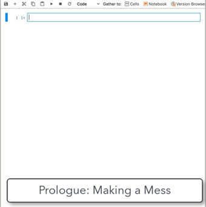

# nbgather: 🧽✨ Spit shine for computational notebooks 

Tools for cleaning code, recovering lost code, and comparing
versions of code in Jupyter Lab.

Download the alpha extension with the following command:

```bash
jupyter labextension install nbgather
```

Then you can clean and compare versions of your code like so:



**Did the `install` fail?** Make sure Jupyter Lab is
up-to-date, and that you are running Jupyter Lab from Python 3.

**Alpha status**: this extension is in alpha: the code it collects
will sometimes be more than you want, and the user interface has
a few quirks.

Help us make this a real, and really useful tool. We welcome
any and all feedback and contribution. We are in particular
need of the opinions and efforts of those with a penchant
for hacking code analysis.

## Contributing

To run the development version of nbgather, run:

```bash
git clone <this-repository-url>  # clone the repository
npm install                      # download dependencies
jupyter labextension link .      # install this package in Jupyter Lab
jlpm run watch                   # automatically recompile source code
jupyter lab --watch              # launch Jupyter Lab, automatically re-load extension
```

This requires npm version 4 or later, and was tested most
recently with Node v9.5.0.

Submit all change as a pull request. Feel free to author the
the lead contributor (Andrew Head, <andrewhead@berkeley.edu>) if
you have any questions about getting started with the code or
about features or updates you'd like to contribute.

Also, make sure to format the code and test it before submitting
a pull request, as described below:

### Formatting the code

Before submitting a pull request with changed code, format the code
files by running `jlpm run format:all`.

### Testing the code

The tests assume you have Google Chrome installed on your
computer. Because this plugin depends on Jupyter Lab and in
turn on browser functionality, some of these tests need a
browser to run in.

To run the tests from the command line, call:

```bash
npm run test
```

Wait a few seconds while the code compiles, and then you
should see the results of running the tests. The process
will continue to live after the tests finish running---it
will recompile and re-run the tests whenever the test code
changes. Type Ctrl+C to abort the command at any time.

Note that running tests with this command may interfere with
you opening Chrome browsers. If that happens, cancel the
command, open Chrome, and then restart the command.

To debug the tests, call:

```bash
npm run test:debug
```

This will launch a Chrome window. Click the **DEBUG**
button in the page that opens. Launch the Chrome developer
tools (View -> Developer -> Developer Tools). The "Console"
will show the test results, with one line for each test. In
the "Sources" tab, you can open scripts using the file prompt
(Cmd + P on Mac, Ctrl + P on Windows) and set breakpoints in
the code. When you refresh the page, the tests will be run
again, and the debugger will trigger when the first
breakpoint is reached.

### Packaging the project for alpha users

Package up the project as follows:

```bash
npm pack  # output: <package-name>-<version>.tgz
```

Then send the package to someone else, and have them install
it using this command:

```bash
jupyter labextension install <package-name>-<version>.tgz
```

### Troubleshooting

Here are some tips for dealing with build errors we've encountered
while developing code gathering tools:

* **Errors about missing semicolons in React types files**: upgrade the `typescript` and `ts-node` packages
* **Conflicting dependencies**: upgrade either the Python Jupyter Lab (may require Python upgrade to Python 3 to get the most recent version of Jupyter Lab) or the Jupyter Lab npm pacakges
* **Other build issues**: we've found some issues can be solved by just deleting your `node_modules/` directory and reinstalling it.
